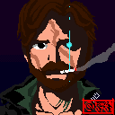

# Pixel-art

Some sprites made in https://www.piskelapp.com/

## Tests

Learn some concepts about animation.

## Pronto

I think it's good (?) or I'm to lazy to fix.

## Learning

Files from TO-DO list.

##  TO-DO List

Following this article http://pixeljoint.com/forum/forum_posts.asp?TID=11299 and https://web.archive.org/web/20120421161044/http://pixel-zone.rpgdx.net/shtml/tut-selout.shtml

Create some arts (Lern some concepts of art):

* Using 1 color (disregarding black or white)
    1. 32x32 (done)
    2. 64x64
    3. 128x128

* Using 2 color
    1. 32x32 (done)
    2. 64x64
    3. 128x128

* Using 4 color
    1. 32x32 (done)
    2. 64x64
    3. 128x128

* Using 16 color
    1. 32x32 (done)
    2. 64x64
    3. 128x128

* Use Dithering
* Use stylized Dithering
